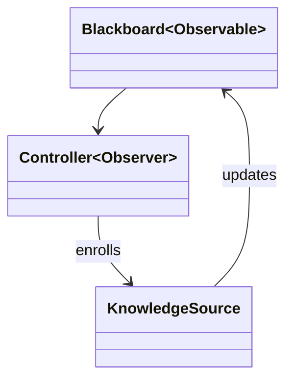

---
title: Blackboard pattern
---

The Blackboard pattern is often applied to problem scenarios where a system gets data input in a continuous stream and the system needs to make some decisions or solve a problem

The Blackboard receives input (BlackBoardObjects) in a continuous stream. The Blackboard (an Observable) notifies the controller (an Observer) whenever it receives a Blackboard object. 

The controller enrolls a knowledge source — that can handle the task — whenever it is notified about a Blackboard object. 

The knowledge sources run in their own thread, process the Blackboard object, and update the Blackboard with a “partial solution Blackboard object.” 

The solution process continues with the Blackboard notifying the controller of the “partial solution Blackboard object” and so forth. 

When the controller receives a Blackboard object whose isReady flag is true, then the controller executes a solution step.

